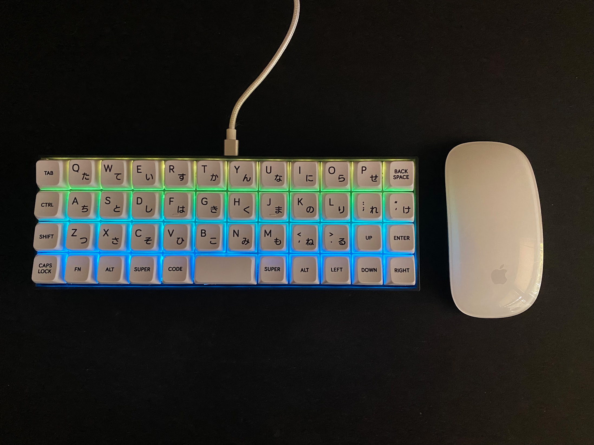

+++
title = "Inland MK-47"
date = 2024-06-02
+++

## Cheap QMK ortho-linear keyboard

This keyboard is an amazing low commitment introduction to ortho-linear keyboards. I'm glad they included QMK support, because in my opinion, any keyboard smaller than a TKL should use QMK

It's also hotswap!

## Mods applied

Of course I had to mod the keyboard!

- Swapped the stems of the original switches with [UHMWPE stems](https://www.google.com/search?client=firefox-b-1-d&q=uhwmpe+stems)
  - The stock switches are linear Huano Reds and the stems fit really well
- Add silencing foam underneath the PCB
- Lubed the stock stabilizer with Kryotox 205g0

## Meh keycaps

I wish they sold a version with blank keycaps. 

Ortholinear keyboards are very personal and the location of the legends that their keycaps provided don't make much sense to me.

I don't usually look down on my keyboard but I like knowing that the legend of the key that I pressed corresponds to the action that it does.

Fortunately, I had a ton of extra keycaps from a time when I was spending all of my income on anything related to keyboards (not my smartest investment).



## Keymap

I took inspiration from the [Miryoku keymap](https://keymapdb.com/keymaps/manna_harbour/) 

Holding home row keys to act as modifiers is brilliant!

I wish I had known about this keymap when I used to own multiple 40% keyboards.

For reference, my keymap in its entirety:
```c
// Tap-hold modifiers
#define LSHTP LSFT_T(KC_F)
#define LSTAP LCMD_T(KC_D)
#define LMTAP LOPT_T(KC_S)
#define LCTAP LCTL_T(KC_A)

#define RSHTP RSFT_T(KC_J)
#define RSTAP RCMD_T(KC_K)
#define RMTAP ROPT_T(KC_L)
#define RCTAP RCTL_T(KC_SCLN)

enum custom_layers {_BASE, _NUM, _NAV, _FUN, _MEDIA};

Welcome to the Emacs shell

~/Code/Projects_Hugo/portfolio/content/posts/MK-47 $ // clang-format off
const uint16_t PROGMEM keymaps[][MATRIX_ROWS][MATRIX_COLS] = {

    [_BASE] = LAYOUT(
        KC_CAPS, KC_Q,  KC_W,  KC_E,     KC_R,             KC_T,   KC_Y,             KC_U,       KC_I,    KC_O,   KC_P,    KC_BSPC,
        KC_ESC,  LCTAP, LMTAP, LSTAP,    LSHTP,            KC_G,   KC_H,             RSHTP,      RSTAP,   RMTAP,  RCTAP,   KC_QUOT,
        KC_GRV,  KC_Z,  KC_X,  KC_C,     KC_V,             KC_B,   KC_N,             KC_M,       KC_COMM, KC_DOT, KC_SLSH, KC_BSLS,
        KC_NO,   KC_NO, KC_NO, MO(_FUN), LT(_NAV, KC_TAB), KC_SPC, LT(_NUM, KC_ENT), MO(_MEDIA), KC_NO,   KC_NO,  KC_NO),

    [_NUM] = LAYOUT(            /* Numbers */
        KC_TRNS, KC_LBRC, KC_7,    KC_8,    KC_9, KC_RBRC, KC_TRNS, KC_TRNS, KC_TRNS, KC_TRNS, KC_TRNS, KC_TRNS,
        KC_TRNS, KC_MINS, KC_4,    KC_5,    KC_6, KC_EQL,  KC_TRNS, KC_TRNS, KC_TRNS, KC_TRNS, KC_TRNS, KC_TRNS,
        KC_TRNS, KC_LPRN, KC_1,    KC_2,    KC_3, KC_RPRN, KC_TRNS, KC_TRNS, KC_TRNS, KC_TRNS, KC_TRNS, KC_TRNS,
        KC_TRNS, KC_TRNS, KC_TRNS, KC_TRNS, KC_0, KC_TRNS, KC_TRNS, KC_TRNS, KC_TRNS, KC_TRNS, KC_TRNS),

    [_NAV] = LAYOUT( /* Navigation */
        KC_TRNS, KC_TRNS, KC_TRNS, KC_TRNS, KC_TRNS, KC_TRNS, KC_TRNS, KC_PGUP, KC_UP,   KC_PGDN, KC_TRNS, KC_TRNS,
        KC_TRNS, KC_TRNS, KC_TRNS, KC_TRNS, KC_TRNS, KC_TRNS, KC_TRNS, KC_LEFT, KC_DOWN, KC_RGHT, KC_INS,  KC_TRNS,
        KC_TRNS, KC_TRNS, KC_TRNS, KC_TRNS, KC_TRNS, KC_TRNS, KC_TRNS, KC_HOME, KC_TRNS, KC_END,  KC_DEL,  KC_TRNS,
        KC_TRNS, KC_TRNS, KC_TRNS, KC_TRNS, KC_TRNS, KC_TRNS, KC_TRNS, KC_TRNS, KC_TRNS, KC_TRNS, KC_TRNS),

    [_FUN] = LAYOUT( /* Function */
        KC_NO, KC_NO,   KC_NO,   KC_NO,   KC_NO,   KC_NO, KC_PAUS, KC_F1,   KC_F2,   KC_F3,  KC_F4,  RGB_TOG,
        KC_NO, KC_TRNS, KC_TRNS, KC_TRNS, KC_TRNS, KC_NO, KC_SCRL, KC_F5,   KC_F6,   KC_F7,  KC_F8,  RGB_MOD,
        KC_NO, KC_NO,   KC_NO,   KC_NO,   KC_NO,   KC_NO, KC_NO,   KC_F9,   KC_F10,  KC_F11, KC_F12, RGB_VAI,
        KC_NO, KC_NO,   KC_NO,   KC_NO,   KC_NO,   KC_NO, RGB_HUI, RGB_SAI, RGB_SPI, KC_NO,  QK_BOOT),

    [_MEDIA] = LAYOUT(          /* Media */
        KC_NO, KC_MPRV, KC_MPLY, KC_MNXT, KC_NO, KC_NO, KC_NO, KC_NO, KC_NO, KC_NO, KC_NO, KC_NO,
        KC_NO, KC_MUTE, KC_VOLD, KC_VOLU, KC_NO, KC_NO, KC_NO, KC_NO, KC_NO, KC_NO, KC_NO, KC_NO,
        KC_NO, KC_NO,   KC_NO,   KC_NO,   KC_NO, KC_NO, KC_NO, KC_NO, KC_NO, KC_NO, KC_NO, KC_NO,
        KC_NO, KC_NO,   KC_NO,   KC_NO,   KC_NO, KC_NO, KC_NO, KC_NO, KC_NO, KC_NO, KC_NO)
};
```
## Comfort

Nonsplit ortholinear keyboards feel a little too cramped for my taste and I'm a pretty compact guy.

I start to feel a bit of shoulder discomfort if I keep my digits on the keys while I think.

## Conclusion

For its price point, it's a good introduction to the world of ortholinear keyboards and finding your perfect keymap. I honestly can't use it as a daily driver because of the mental overhead involved when I have to figure out where I mapped rarely used keys and the discomfort I feel on my shoulders over time.
