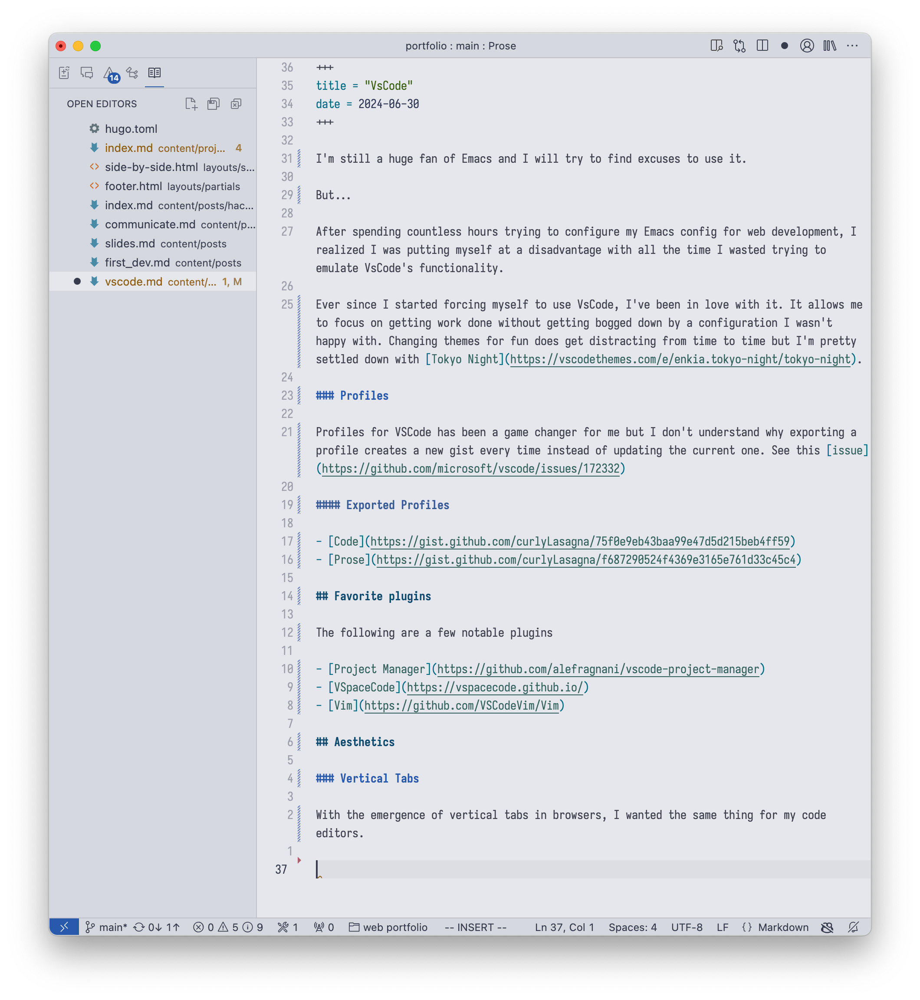

+++
title = "VsCode"
date = 2024-06-30
+++

I'm still a huge fan of Emacs and I will try to find any excuse to use it.

But...

After spending countless hours trying to configure my Emacs config for web development, I realized I was putting myself at a disadvantage with all the time I wasted trying to emulate VsCode's functionality.

Ever since I started forcing myself to use VsCode, I've been in love with it. It allows me to focus on getting work done without getting bogged down by a configuration I wasn't happy with. Changing themes for fun does get distracting from time to time but I'm pretty settled down with [Tokyo Night](https://vscodethemes.com/e/enkia.tokyo-night/tokyo-night).

### Profiles

Profiles for VSCode has been a game changer for me but I don't understand why exporting a profile creates a new gist every time instead of updating the current one. See this [issue](https://github.com/microsoft/vscode/issues/172332)

#### Exported Profiles

- [Code](https://gist.github.com/curlyLasagna/75f0e9eb43baa99e47d5d215beb4ff59)
- [Prose](https://gist.github.com/curlyLasagna/f687290524f4369e3165e761d33c45c4)

## Favorite plugins

The following are a few notable plugins

- [Project Manager](https://github.com/alefragnani/vscode-project-manager)
- [VSpaceCode](https://vspacecode.github.io/)
- [Vim](https://github.com/VSCodeVim/Vim)

## Aesthetics

### Vertical Tabs

With the emergence of vertical tabs in browsers, I wanted the same thing for my code editor.

I'm also not a fan of tabs polluting my view.
