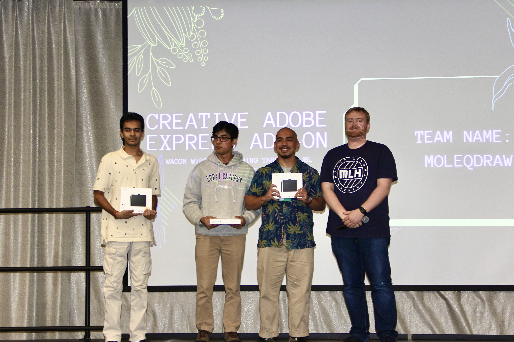

+++
title = "Hackathons"
date = 2024-08-20
+++
> tldr;
>
> If you want to win at something, do something no one else wants to do.
>
> Don't sleep on the sponsored prize track. It can significantly cut down on the brainstorming process

Check out the project at [DevPost](https://devpost.com/software/druggenerator)

## First Hackathon Win

I went to HackUMBC without a project in mind. I honestly just wanted to hangout and network with people.

Although my project is nothing impressive, I was proud of its simplicity.

## Arriving at the event

The line to sign in extended outside of the building and all the way to the parking lot.

I instantly felt imposter syndrome when I saw a kid bring carrying a monitor with him. He is not here to mess around.

I started talking to people in line and a few students from my university showed up and practically cut in line with me!

## Assembling a team

I ended up with a team of 4, to my surprise.

It started off when I said hey to a girl (**Bea**). Then a lone freshmen introduced himself (**Vishwa**) and wanted to join our team, although me and Bea didn't even agree to be in a team yet.

So we were now 3 and then a friend from the software engineering club (**Abim**) tagged along and the team is now 4

## Brainstorming

This part was really hard. Everyone in my team had a hard time coming up with an idea. Bea didn't feel too good so she had to go home. So it was down to 3.

I saw a pamphlet at the MLH booth about winning prizes for the sponsor tracks and Adobe Express was one of them.
I was dead set on making an Adobe Express add-on because of the reward.

### Adobe Express Add-On eureka moment

The reward from Adobe is a wireless Wacom drawing tablet and a small JBL bluetooth speaker. I've always wanted to try out a drawing tablet.

I can't recall if it Vishwa or Abim who brought up inserting chemistry symbols because they found an API that returns chemistry symbols but I initially didn't give it a lot of thought.

I started looking at the past winning submissions for this this track and there was an add-on that won, where it generates math equation, given a LaTeX input.

I started putting two and two together and came up with an add-on that returns chemistry symbols as an image, similar to the add-on that returns math symbols.

## Implementation

Fortunately, there were code samples that I was able to get ideas from.
The JS SDK that Adobe Express provided was really intuitive. The entire development process was so simple, it only took me a few hours to complete an minimum viable product.
