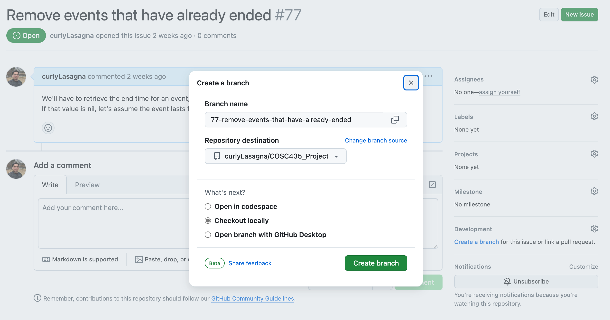
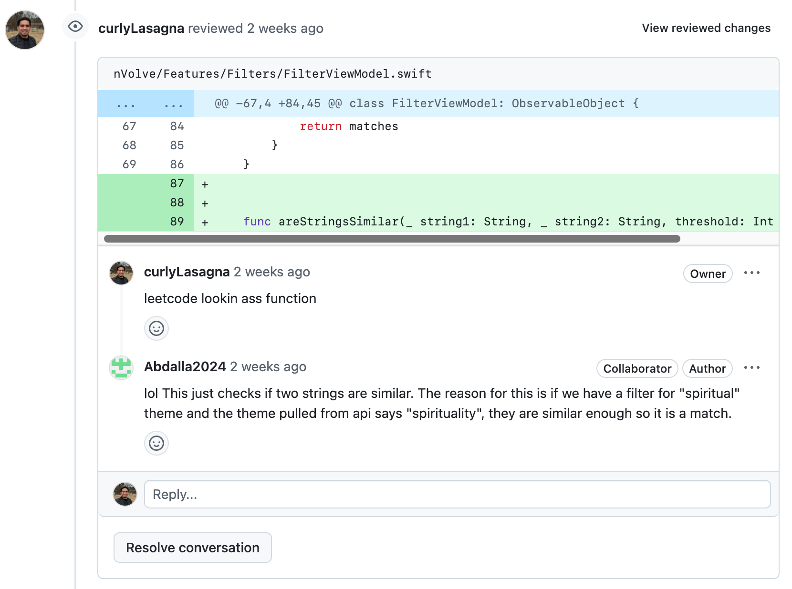
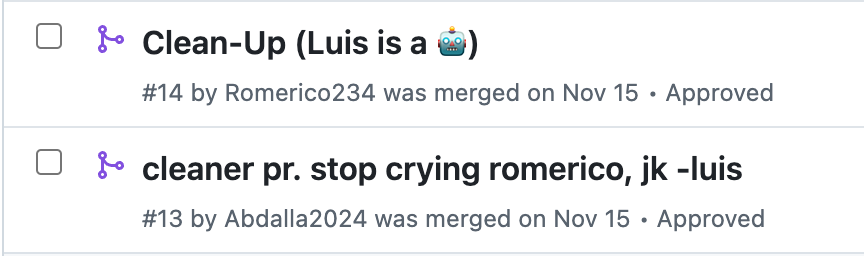

+++
title = 'NVolve iOS app'
date = 2024-12-13T20:28:36-05:00
+++

[GitHub Repository](https://github.com/curlyLasagna/COSC435_Project)
## Purpose

As a commuter who has to drive an hour to get to my school, I opt to stay in campus for the rest of the day to make the most out of my drive. This means coming up with things to do while I'm in campus before boredom strikes. I'm a bit of an extrovert and someone who enjoys free food, so I always look for events to participate.

Towson University has 2 sources of events:

- [involved](https://involved.towson.edu/events)
- [events](https://events.towson.edu/).

There is also [Handshake](https://towson.joinhandshake.com/stu/events?collection=ALL&eventFormat=HYBRID&sort=RELEVANCE&date=ALL) but I need auth to get anything from their GraphQL endpoint and I figured it's not worth the effort.

This app collects events for the current day and shows where events are being held with an interactive map.






### Features

- Getting directions to the event
  - Users are redirected to their chosen Map application
- Favorite an event
  - Cleared every day
  - Sends a notification to a user when an event is about to start
  - Event is pushed to the front of the list
- Filter events by perks and theme

### Development Process

Taking what I've learned from my time at SecurEd, I introduced my team with the software development process of feature branches.
Fortunately, I had a team member who's familiar with the process I had in mind.

Anyone can create an issue. We try to be as descriptive as much as possible, but the majority of the details are shared through conversations in our Slack channel. We don't assign anyone any specific issue, it's whoever assigns themselves first to work on the issue.

#### Branching



I've always struggled with coming up with branch names, but GitHub generates a branch name based on the issue number and the title, which I've found sufficient enough.

#### Code Review

Whenever they believe they're finished with the task, team mates push their branch with their changes. A pull request is created and the other team members review the code.

A few highlight PRs:



## My role

Since this app was my idea, I had to come up with most of the features.

I was responsible for setting up the HTTP requests for the 2 data sources.

I used 2 free tools that aided me with getting the data that I need:

- [quicktype](https://quicktype.io/)
  - Serializes JSON to a different languages
- [JSON Crack](https://jsoncrack.com/)
  - Visual representation of JSON data

### Challenges Faced

- A few of the events had null coordinates or were set to an incorrect location. As a workaround, I choose to discard these events from rendering on the map.

- I ran into a bug where clicking on an event marker on the app would load an empty modal. I gave it my best shot at resolving this UI bug but I had other finals to deal with, so LLM's to the rescue:

```
// Credits to Claude because I would've never come up with whatever this is
EventInfo(
    showEvent: Binding(
        get: { selectedEvent != nil },
        set: { if !$0 { selectedEvent = nil } }
    ), event: event)
```