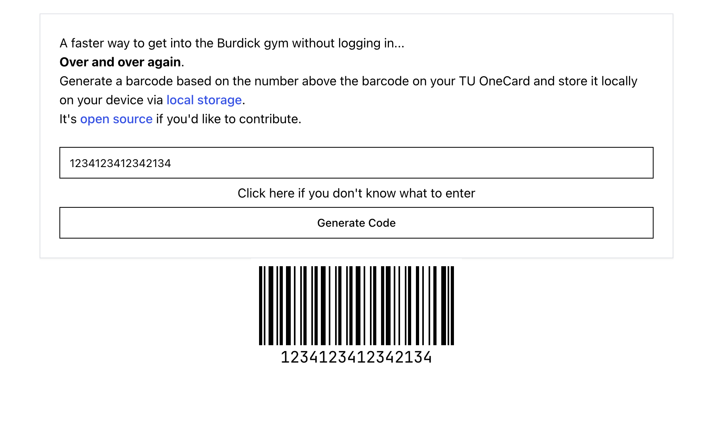

+++
title = 'Scanfast'
date = 2025-02-07T09:51:06-05:00
+++

ScanFast is a dead simple single page application barcode generator for Towson University services with offline functionality via PWA.

It saves your your barcode value in local storage. Students rarely have their barcode value change, so it's just a one time setup.

Visit https://scanfast.netlify.app/ to try it out!

## Tech Stack

- [React](https://react.dev/)
- [Vite](https://vite.dev/)
- [shadcn](https://ui.shadcn.com/)

## What problem does it solve?

The gym at my university offers a mobile app that allows you to check-in by generating a barcode after you log in with your university account. The annoying problem that it has is that the authentication token expires really fast, which prompts the user to log in every time they visit the gym. It wasn't much of an issue for me as I use a password manager but for those who don't, they usually stand in front of the entrance to type and typos do occur.

## How did I solve the problem?

Once I learned that a barcode is just another way of representing data in machine-readable form, I started using online barcode generators to check into the gym by inputting the values above the barcode in my university ID. 

I tried shopping around for a barcode generator app I can use in my phone but I wanted something simple and convenient.

## Initial failures
I decided that I'll finally commit to front-end web dev project. 

I initially started with the [qwik](https://qwik.dev/) with no understanding of its benefits.

Locally, the website worked pretty well but once it was hosted, I had to refresh the page every time for it to work properly. 

It wasn't a good look at first so I decided to scrap the whole thing and re-write it in React.

The scope of the project was small enough that a re-write wasn't going to take a lot of time.

## Hosting

I opted to use Netlify for hosting. Very generous free tier and given the simplicity of the app, it rarely uses any bandwidth.

